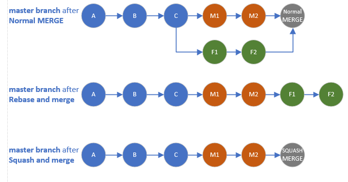
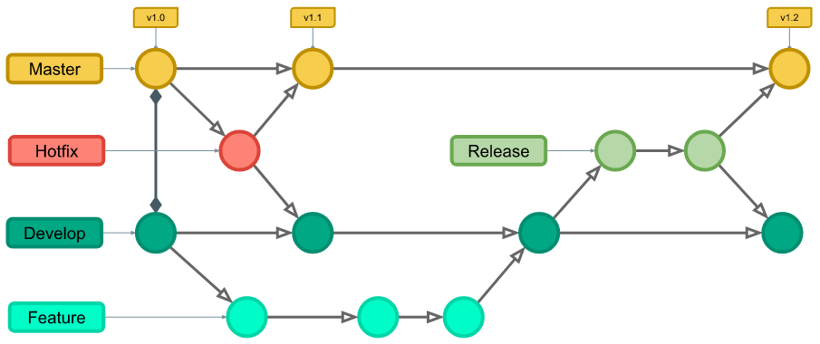

# Boas práticas

## Commits

### Commits atômicos

Um commit não deve conter várias mudanças ao mesmo tempo, mas apenas uma mudança. Isso não significa que apenas um arquivo deve ser alterado no commit, mas que ele representa uma única mudança encapsulada. Isso é bom porque, caso você queira voltar no tempo em um commit, você sabe exatamente aonde voltar. Além disso, o histórico de commits fica mais limpo. Não haverão commits gigantes. Também fica mais fácil de revisar Pull Requests com commits atômicos.

Ex: digamos que você está trabalhando numa issue em que você deve, num momento, atualizar a lista de usuários e, em outro, atualizar um log com erros. Ao invés de fazer isso tudo em um só commit, separe o seu trabalho em 2 commits.

### Co-authors

Muitas vezes, você não será o único a realizar um trabalho em um commit, mas trabalhará em equipe. O `co-author` é uma forma que serve para identificar co-autores de um commit na mensagem dele. Para adicionar um co-author em um commit, basta, no comentário do commit, adicionar o seguinte boilerplate:

`Co-authored-by: nome do co-autor <email>`.

Ex:

```
feat: adiciona Dockerfile para o back-end

Co-authored-by: José da Silva <josedasilva@gmail.com>
```

OBS: é importante que, entre o título e o comentário do commit, haja um espaçamento de, no mínimo, 2 linhas. 

### Mensagens descritivas

É importante que cada commit tenha uma descrição bem feita do que ele altera. Isso facilita muitas coisas (identificar um commit, revertê-lo, revisá-lo, etc).

Ex de commit com mensagem não descritiva:

```
Adicionando endpoint 
```

Ex de commit com mensagem descritiva (para o mesmo trabalho realizado):

```
Adiciona endpoint para busca de usuários cadastrados
```

Você também pode adicionar comentários, caso julgue necessário:
Ex:

```
Adiciona endpoint para busca de usuários cadastrados

Apenas os usuários com registro premium foram cadastrados, pois a conta de usuários comuns têm data de expiração.
```

### Uso de convenções e padrões de commits

Convenções e padrões de commits facilitam a leitura do histórico de commits. Eles devem ser decididos pelos mantenedores do repositório. Alguns exemplos de padrões: 

- **feat**: adiciona nova funcionalidade no projeto;
- **docs**: altera arquivos de documentação;
- **fix**: conserta algum bug ou realiza qualquer alteração que não é exatamente um feat;

Exemplo de uso:

```
docs: atualiza README com informações dos membros da equipe

Co-authored-by: fulaninho <fulano@hotmail.com>
```

### Mencionar issues

É possível rastrear um commit a partir de uma issue, desde que esse commit referencie a issue. Para realizar essa referência, basta utilizar o caracter `#` seguido do número da issue.
Ex:

```
feat: realiza tratamento de dados advindos da api externa

relativo à #23.
```

Na plataforma git, ao abrir a issue #23, pode-se encontrar uma referência para este commit.

## Pull Requests / Merge Requests

### Não faça uma release inteira em um PR

Mantenha as branches concisas. Certifique-se de que cada branch tem um conjunto de alterações bem definido e pequeno. Isso torna muito mais fácil a revisão das alterações. Além disso, se você faz muitas alterações em uma só branch, é muito possível que, ao longo do tempo, outras branches foram mescladas à branch original, de forma que algumas de suas alterações podem estar obsoletas.

### Ao aceitar um PR, apague a branch aceita

Isso serve simplesmente para não poluir o conjunto de branches com branches já mescladas e inativas.

### Opções de merge

Ao aceitar um PR, algumas opções de merge podem ser escolhidas. Das 3 abaixo, `rebase and merge` e `squash and merge` oferecem uma possibilidade de manter um histórico de commits mais limpos.



#### Merge commits

Essa opção adicionará todos os commits da branch nova à branch de destino, e adicionará um commit extra de merge.

#### Rebase and merge

Quando um PR for aceito, é possível escolher a opção `rebase and merge` para mesclá-lo à branch de destino. Essa opção faz com que o histórico de commits fique mais limpo e linear.

**OBS**: de maneira simples, o rebase vai adicionar (append) os commits da branch nova ao final dos commits da branch de destino, sem um commit adicional de merge. 

#### Squash and merge

Nesta opção, todos os commits da branch nova serão reduzidos a apenas um, e ele será adicionado (append) ao final dos commits da branch de destino. 

### Antes de abrir o PR, realize os testes necessários localmente

Isso parece óbvio (porque é mesmo), mas é muito comum que pessoas realizem as alterações na sua branch feature e, ao final do trabalho, abram o PR sem realizar os testes necessários (unitários, de integração, etc). Isso gera perda de tempo. 

### Ao revisar o PR, procure o óbvio

Pergunte-se se o código é legível, se os nomes de variáveis têm alguma significância de fato, se o código está bem documentado, se testes foram escritos, e por aí vai. Neste passo, o uso de `Pull request templates` pode ajudar tanto o autor do código quanto o revisor, visto que esses templates podem trazer um checklist com requisitos para que a branch seja mesclada.

### Ao revisar o PR, procure coisas não tão óbvias assim

Embora a dica acima seja um bom primeiro passo, muitas vezes, o problema está nos detalhes: existe algum erro na lógica da solução apresentada? O design da solução faz sentido mesmo para o problema apresentado? Existem problemas futuros que podem aparecer caso essa solução seja aceita? Se sim, vale a pena seguir em frente ou é melhor mudar de solução? 

### Utilize Pull Request Templates

O uso de `pull request templates` pode facilitar a aplicação das boas práticas descritas acima. 

## Issues

### Utilize Issue Templates para diminuir a carga cognitiva

Issues são excelentes para documentar o trabalho necessário para atingir os objetivos do projeto. Escrevê-las, por outro lado, pode se mostrar trabalhoso. O uso de `issue templates` facilita esse processo (e o processo de desenvolvimento como um todo), pois padroniza o tipo de issues que serão criadas no projeto, acelerando o processo de escrita. 

### Use Labels

Uma issue pode ser atrelada em algumas labels, que ajudam a identificar qual é o tipo de issue que está sendo tratada. Alguns exemplos de labels são:

- feature: issues com essa label tratam de novas funcionalidades no código;
- documentation: issues com essa label tratam de alterações na documentação do projeto;
- fix: issues com essa label tratam de consertos de bugs;

E assim por diante. Plataformas como o gitlab e o github trazem um conjunto padrão de labels para cada projeto, mas essas podem ser ou não utilizadas. Além disso, novas labels podem ser criadas, de maneira personalizada para cada projeto.

### Defina assignees

Um assignee, basicamente, é aquele que vai realizar o trabalho solicitado por uma issue. O uso de assignees facilita o processo de desenvolvimento, visto que define quem fará o quê no projeto.

### Quando possível, utilize Kanban Boards

O gitlab permite que o sistema de issues seja utilizado para a aplicação de [kanban boards](https://www.atlassian.com/agile/kanban/boards) no projeto. Essa ferramenta é muito utilizada para facilitar o gerenciamento de projetos.

## Políticas de branches

### O que são?

Políticas de branches são regras, definidas pela equipe do projeto, que dizem como as branches devem ser utilizadas. Essas regras vão desde a nomenclatura das branches até a forma com a qual elas serão criadas e mescladas. Alguns exemplos são:

- uma branch por issue;
- uma branch por feature;
- uma branch por dupla (caso em que o [pair programming](https://www.techtarget.com/searchsoftwarequality/definition/Pair-programming) é atividade comum no processo);

Entre outras. 

### Gitflow

O gitflow é uma estratégia de branching que funciona, basicamente, da seguinte forma: uma branch principal (`main`) contém o produto. Uma branch secundária (`develop`) contém o código de desenvolvimento. Branches são criadas a partir da develop para adicionar novas funcionalidades, consertar bugs, e etc. Ao final do desenvolvimento na develop, ela é mesclada à main. Branches de conserto (`hotfix`) também podem ser criadas a partir da main para consertos de bugs em produção.


